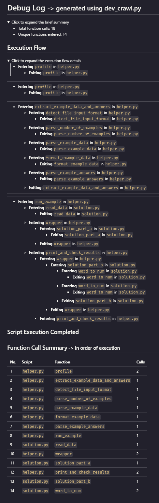

# dev_crawl.py - Python Debugging Automation Tool

## Introduction
`dev_crawl.py` is a Python automation tool designed to streamline the debugging process. It enhances Python scripts by injecting debugging statements, manages debug logs, and intelligently handles nested scripts and their imports.

## Key Features
- **Automated Debugging Statement Injection:** Automates the insertion of debugging statements into Python scripts, extending support to nested and interdependent scripts.
- **Selective Import Modification:** Dynamically modifies import statements in scripts to include their debug-enhanced versions, but only for scripts specified in the same run.
- **Simultaneous Multiple Script Handling:** Efficiently processes multiple scripts in a single run, respecting their dependencies and nesting.
- **Versatile Debug Log Management:** Offers options for terminal output, debug.log output, and log reformatting for enhanced readability or markdown conversion.

## Requirements
- Python 3.6 or later
- `astor` library
- Standard Python libraries: `argparse`, `ast`, `os`, `collections`

## Installation
Clone the repository from GitHub and install the dependency:

```bash
git clone https://github.com/http-kennedy/dev_crawl
cd dev_crawl
pip install -r requirements.txt
```

## Workflow and Usage

`dev_crawl.py` can be used in various ways, with single or multiple scripts, and offers different output options through flags.

### Single and Multiple Script Modification
- For a single script:
  ```bash
  python dev_crawl.py script1.py
  ```
- For multiple scripts:
  ```bash
  python dev_crawl.py script1.py script2.py
  ```
- For multiple scripts with hierarchical dependencies:
  ```bash
  python dev_crawl.py script1.py script2.py utils/script3.py
  ```

### Output Options
- Default (Print to Terminal):
  - Without any flags, the modified scripts will output debug information to the terminal.
  ```bash
  python dev_crawl.py script1.py
  ```
- Using `--debug-to-file`:
  - With this flag, debug outputs are directed to `debug.log`.
  ```bash
  python dev_crawl.py --debug-to-file script1.py
  ```
  - You can then reformat `debug.log` for readability:
    ```bash
    python dev_crawl.py --reformat-log debug.log
    ```
  - Or convert `debug.log` to markdown format:
    ```bash
    python dev_crawl.py --reformat-log-md debug.log
    ```

### Resetting `debug.log`
To re-initialize `debug.log`:
```bash
python dev_crawl.py --clear-debug-log
```
## Screenshots

<details>
  <summary>Basic Debug Log (Click to Expand)</summary>
  <a href="debug_log.png">
    
  </a>
</details>

<details>
  <summary>Basic Markdown Output (Click to Expand)</summary>
  <a href="markdown_log_basic.png">
    
  </a>
</details>

<details>
  <summary>Full Markdown View (Click to Expand)</summary>
  <a href="markdown_log_full.png">
    
  </a>
</details>

<details>
  <summary>Detailed Execution Flow (Click to Expand)</summary>
  <a href="markdown_detailed.png">
    
  </a>
</details>


## Intelligent Import Handling
`dev_crawl.py` intelligently adjusts import statements in scripts to refer to their debug versions, but only when an import name matches the script name passed to dev_crawl.py at the same modification execution. This ensures that debug modifications are applied consistently across interrelated scripts.

## Contributing
I welcome contributions to improve `dev_crawl.py`. Please submit pull requests or open issues for discussion.

## License
`dev_crawl.py` is released under the CC0-1.0 License. Please see the LICENSE file for full license details.

## Contact
For questions or feedback, please open an issue in the GitHub repository.
